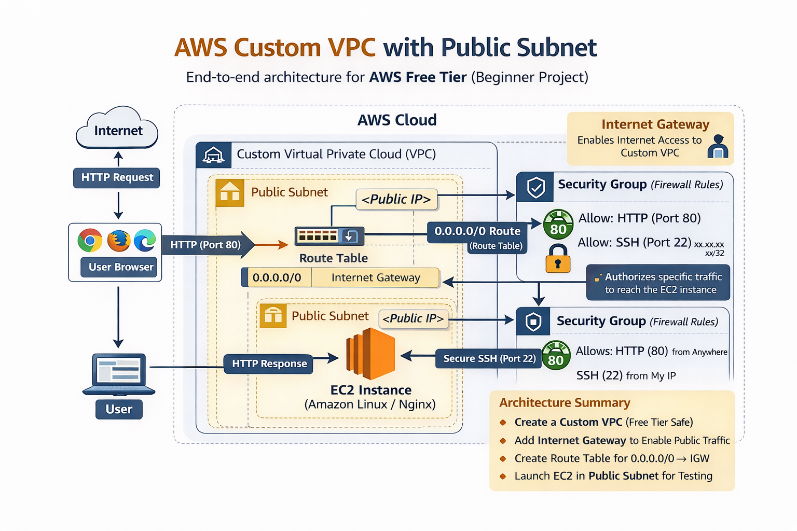

# Mini Project 9: Custom VPC with Public Subnet (AWS Free Tier)

## 📌 Project Overview
This project demonstrates how to design and test a **Custom Virtual Private Cloud (VPC)** on AWS instead of using the default VPC.  
A public subnet is created inside the custom VPC, connected to the internet using an **Internet Gateway** and **Route Table**, and an **EC2 instance** is launched to verify internet connectivity.

This project forms the **foundation for advanced architectures** such as Load Balancers, Auto Scaling, and 3-Tier applications.

---

## 🎯 Project Objectives
- Create a Custom VPC from scratch
- Design a Public Subnet
- Attach and configure an Internet Gateway
- Configure Route Table for internet access
- Launch and test EC2 connectivity
- Perform full cleanup to stay AWS Free Tier safe

---

## 🧱 Architecture Diagram

---

## 🛠 AWS Services Used

| Service            | Purpose                              | Free Tier |
|--------------------|--------------------------------------|-----------|
| Amazon VPC         | Custom network isolation              | ✅ Yes    |
| Subnet             | Network segmentation                  | ✅ Yes    |
| Internet Gateway   | Internet access                       | ✅ Yes    |
| Route Table        | Traffic routing                       | ✅ Yes    |
| EC2 (t2.micro)     | Connectivity testing                  | ✅ Yes*   |

\* EC2 used temporarily and terminated after testing.

---

## 🚀 Implementation Steps (High Level)

1. Created a **Custom VPC** with CIDR `10.0.0.0/16`
2. Created a **Public Subnet** (`10.0.1.0/24`)
3. Created and attached an **Internet Gateway**
4. Configured **Route Table** with `0.0.0.0/0 → IGW`
5. Associated route table with the public subnet
6. Launched an **EC2 instance** with a public IP
7. Verified internet access via browser
8. Cleaned up all resources to avoid cost

---

## 🧪 Output Verification

### 🔹 Instance ec2

### 🔹 security group enable HTTP

### 🔹 EC2 Public IP Output

---

## 🧹 Cost & Cleanup
All resources (EC2, IGW, Subnet, Route Table, VPC) were **deleted after successful testing** to ensure:
- No ongoing charges
- Fully AWS Free Tier safe

---

## 🧠 Key Learnings
- Difference between Default VPC and Custom VPC
- How internet traffic reaches an EC2 instance
- Importance of Route Tables in networking
- Foundation knowledge for ALB, Auto Scaling, and RDS

---

## 📎 Notes
This project was implemented purely for **learning and demonstration purposes** using AWS Free Tier resources.

---

## 📬 Author
**Nithya Bharathi**  
Aspiring Cloud / AWS Engineer

